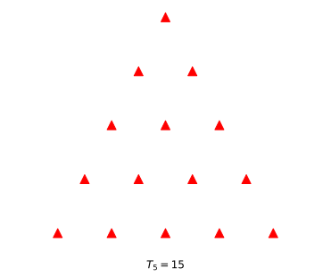
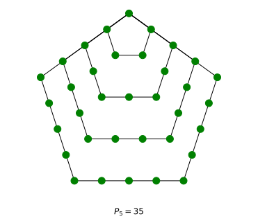
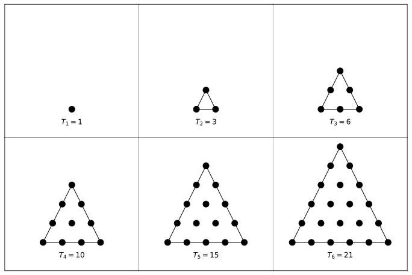
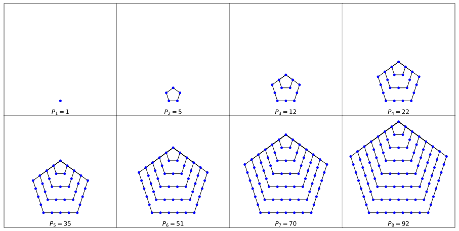

# Figural

> A tiny library for generating, evaluating, and plotting triangular and pentagonal numbers in Python.

## Installation

You can install `figural` using PyPI:

```bash
pip install figural
```

Or from source. Here I am using [uv](https://docs.astral.sh/uv/getting-started/installation/) but you can use any Python environment of your choice:

```bash
git clone https://github.com/twaclaw/figural.git
cd figural
uv venv --python=3.14
source ./venv/bin/activate
uv pip install -e .
```

## Examples

### Generating the ith numbers and testing for membership

```python
import figural.triangular as tr
import figural.pentagonal as pn

tr.ith(5)
# 15

pn.ith(5)
# 35

tr.is_triangular(15)
# np.True_

pn.is_pentagonal(pn.ith(10000000))
# np.True_
```

### Generating ranges

```python
import figural.triangular as tr
import figural.pentagonal as pn
import numpy as np

tr.arange(10)
# array([ 1,  3,  6, 10, 15, 21, 28, 36, 45])

pn.arange(10)
# array([  1,   5,  12,  22,  35,  51,  70,  92, 117, 145])

np.all(pn.is_pentagonal(pn.arange(int(1e8))))
# np.True_
```

### Plotting individual numbers

```python
tr.draw_ith(5, with_label=True)
```


```python
tr.draw_ith(5, with_label=True, color="red", marker_style="^", draw_contourn=False)
```



```python
pn.draw_ith(5, with_label=True, color="green")
```



```python
tr.draw_ith(3, with_label=True, return_tikz=True)
```

<details>
<summary>Click to expand TikZ code</summary>

```latex
% This file was created with tikzplotlib v0.10.1.
\begin{tikzpicture}

\definecolor{darkgrey176}{RGB}{176,176,176}

\begin{axis}[
hide x axis,
hide y axis,
tick align=outside,
tick pos=left,
x grid style={darkgrey176},
xmin=-0.05, xmax=1.05,
xtick style={color=black},
y grid style={darkgrey176},
ymin=-0.05, ymax=1.05,
ytick style={color=black}
]
\addplot [black]
table {%
0 0
1 0
0.5 1
0 0
};
\addplot [semithick, black, mark=*, mark size=5, mark options={solid}, only marks]
table {%
0 0
0.5 0
1 0
};
\addplot [semithick, black, mark=*, mark size=5, mark options={solid}, only marks]
table {%
0.25 0.5
0.75 0.5
};
\addplot [semithick, black, mark=*, mark size=5, mark options={solid}, only marks]
table {%
0.5 1
};
\draw (axis cs:0.5,-0.25) node[
    scale=0.6,
    anchor=north,
    text=black,
    rotate=0.0
]{$T_{3}=6$};
\end{axis}

\end{tikzpicture}
```

</details>

### Plotting ranges of numbers

```python
tr.draw_range(1, 6, with_label=True, cols=3, draw_grid=True)
```



```python
pn.draw_range(1, 8, with_label=True, cols=4, draw_grid=True, color='blue')
```



## Contributing

Sure thing! Feel fre to open an issue or create a pull request.
